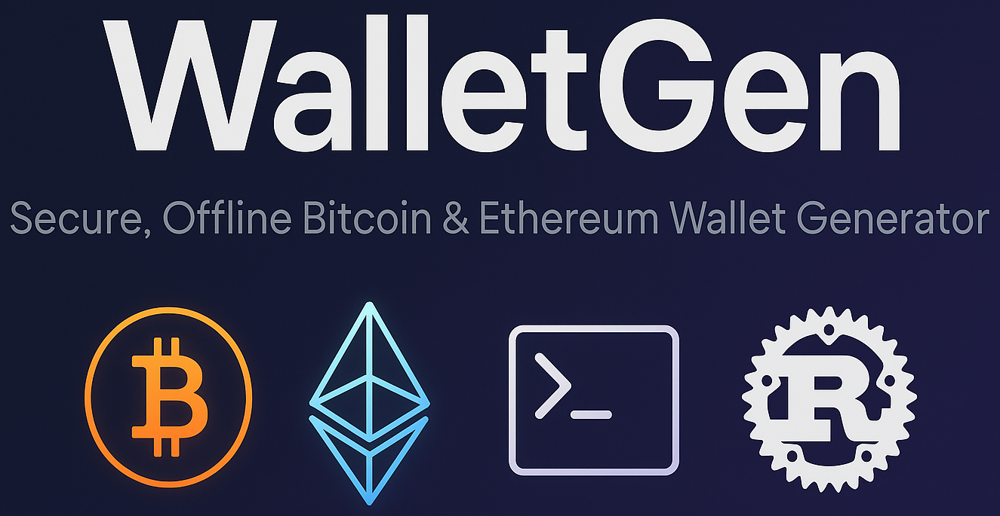

<p align="center">
  
</p>

# 🦀 WalletGen  
**Secure, Offline Bitcoin & Ethereum Wallet Generator**  

WalletGen is a **Rust-powered CLI tool** to **generate, encrypt, and manage** Bitcoin and Ethereum wallets securely -> entirely offline.  
It’s perfect for developers, crypto enthusiasts, and security-focused users who want **full control** of their keys.

---

## 🚀 Why WalletGen?
Crypto wallets are the **gateway** to your funds. Most online generators or browser-based wallets **leak private keys** to third parties or lack strong encryption.  

**WalletGen** solves this by:
- Generating **keys locally**, fully offline ✅
- Supporting **Bitcoin** (mainnet + testnet) & **Ethereum** ✅
- Optional **AES-256-GCM encryption** of private keys ✅
- Saving secure backups as JSON ✅
- Showing **QR codes** for addresses and private keys ✅

Built in **Rust** for **speed**, **security**, and **portability**.

---

## ✨ Features

- 🔐 **Bitcoin & Ethereum wallet generation**
- 🌍 **Mainnet & Testnet** support
- 🔑 **AES-256-GCM encryption** for private keys using **PBKDF2-SHA256**
- 📝 **JSON export** for safe backups
- 🧾 **WIF & Hex private keys**
- 📦 **Multiple wallets at once** (`--count N`)
- 🧩 **QR codes** in terminal for addresses, WIFs, and private keys
- 🛠️ Fully **offline-capable**

---

## 📦 Installation

### **1. Clone the repository**
```bash
git clone https://github.com/YOUR_USERNAME/walletgen.git
cd walletgen
```

### **2. Build the project**
```bash
cargo build --release
```

### **3. (Optional) Install globally**
```bash
cargo install --path .
```

Now you can use it anywhere:
```bash
walletgen gen --coin btc
```

---

## 🛠️ Usage

WalletGen uses two main **subcommands**:  
- `gen` → Generate new wallets  
- `decrypt` → Decrypt encrypted wallets from JSON  

---

### **1. Generate Wallets** (`gen`)

```bash
walletgen gen [OPTIONS]
```

#### **Options**
| Option               | Type      | Default | Description |
|---------------------|-----------|---------|-------------|
| `--coin`            | btc/eth  | `btc`   | Choose which crypto to generate. |
| `--count` / `-c`    | number   | `1`     | Number of wallets to create. |
| `--testnet`         | flag     | off     | Use Bitcoin **testnet** instead of mainnet. |
| `--encrypt`         | flag     | off     | Encrypt private keys (AES-256-GCM). |
| `--out <file>`      | path     | none    | Save wallets to JSON for backup. |
| `--qr`              | flag     | off     | Display QR codes for addresses & private keys. |

---

#### **Examples**

**Generate a single Bitcoin wallet**:
```bash
walletgen gen --coin btc
```

**Generate a single Ethereum wallet**:
```bash
walletgen gen --coin eth
```

**Generate 5 BTC wallets**:
```bash
walletgen gen --coin btc --count 5
```

**Generate BTC testnet wallets**:
```bash
walletgen gen --coin btc --testnet
```

**Generate encrypted BTC wallets and save to JSON**:
```bash
walletgen gen --coin btc --encrypt --out wallets.json
```

**Generate ETH wallets with QR codes**:
```bash
walletgen gen --coin eth --count 2 --qr
```

**Generate multiple BTC wallets, encrypted, saved to JSON, with QR codes**:
```bash
walletgen gen --coin btc --count 3 --encrypt --qr --out btc_wallets.json
```

---

### **2. Decrypt Wallets** (`decrypt`)

```bash
walletgen decrypt --input wallets.json
```

#### **Options**
| Option   | Type | Description |
|----------|------|-------------|
| `--input` | path | JSON file created by `gen --out` |
| `--qr`    | flag | Show QR codes for decrypted WIF/private keys |

---

#### **Examples**

**Decrypt wallets from JSON**:
```bash
walletgen decrypt --input wallets.json
```

**Decrypt and show QR codes**:
```bash
walletgen decrypt --input wallets.json --qr
```

---

## 📂 Example JSON Output

When using `--encrypt --out wallets.json`:

```json
[
  {
    "coin": "btc",
    "network": "mainnet",
    "address": "1CNkiUrr8iyJCt5566rxPbZr6knzcYv4YK",
    "wif_encrypted": {
      "alg": "AES-256-GCM",
      "kdf": "PBKDF2-SHA256",
      "iterations": 200000,
      "salt_b64": "k6nQFmfSYtTpsHVQvXKLEA==",
      "nonce_b64": "ZT4axFskCvBfpntA",
      "ciphertext_b64": "5mC4j8+3+UwvRuj5+ijFNA=="
    }
  }
]
```

---

## 🔒 Security Notes

- **Your keys are generated locally**, they **never leave your machine**.
- Use `--encrypt` + `--out` to safely back up private keys.
- Always test Bitcoin wallets on **testnet** first (`--testnet`).
- Keep JSON backups safe, even encrypted keys are vulnerable if someone gets your passphrase.

---

## 🧩 Roadmap

- [ ] **PNG QR code export** (`--qr-png <dir>`)
- [ ] **Mnemonic seed phrase** support (BIP-39)
- [ ] **HD wallets** (BIP-32 / BIP-44)
- [ ] **Multi-coin support** (LTC, DOGE, etc.)
- [ ] **WebAssembly build** for browser integration

---

## 🦀 Built With
- [Rust](https://www.rust-lang.org/) ⚡ — Safety, speed, and security
- [Secp256k1](https://docs.rs/secp256k1) — Crypto math
- [AES-GCM](https://docs.rs/aes-gcm) — Military-grade encryption
- [PBKDF2](https://docs.rs/pbkdf2) — Secure key derivation
- [QRCode](https://docs.rs/qrcode) — Terminal QR rendering

---

## 📜 License
MIT License, free to use, modify, and share.

---

## 🙌 Contributing
Pull requests are welcome!  
Got an idea? Open an [issue](https://github.com/YOUR_USERNAME/walletgen/issues).

---

## 💡 Example Quick Start

```bash
# Build project
cargo build --release

# Generate 2 encrypted BTC wallets + QR + JSON
walletgen gen --coin btc --count 2 --encrypt --qr --out btc_wallets.json

# Decrypt JSON and view QR codes
walletgen decrypt --input btc_wallets.json --qr
```

---

## 🛡️ Disclaimer
This software is for **educational purposes only**.  
Use at your own risk.  
I take **no responsibility** for lost funds or compromised private keys.